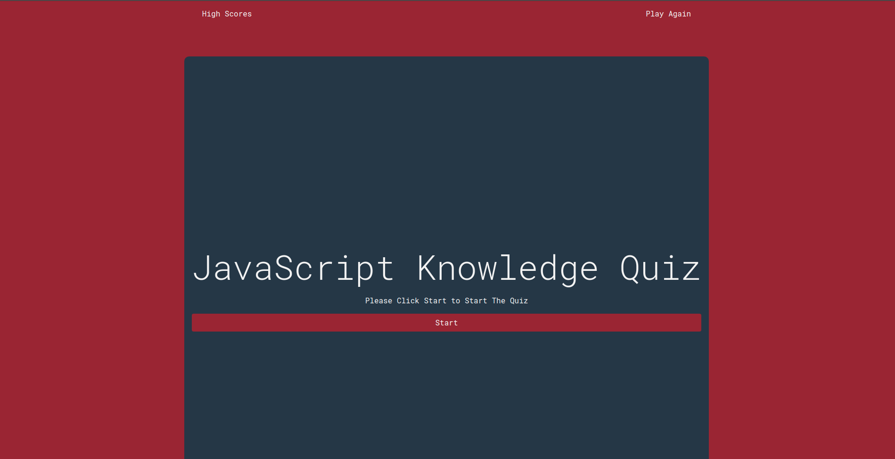
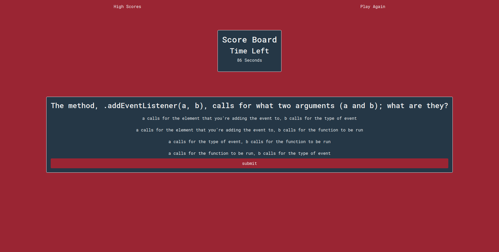

# Multiple Choice JavaScript Quiz

## Description
This web application is a short quiz, 10 questions long about JavaScript. It is meant to log your scores over time, and test your basic knowledge of vanilla JavaScript

## Expected Behavior
1. When the page loads the user is greeted with a large start page, with short set of instructions and a start button.
1. When the user hovers over buttons, they change color.
1. When the user clicks the start button, the user is greeted with the quiz, with a timer that starts at  90 and counts down to zero.
1. When the user clicks on an answer option, it is highlighted and reflects its checked status by maintaining that highlight.
1. When the answer selected is incorrect, the timer subtracts 10 seconds from the clock.
1. When the user finishes all 10 questions, or the timer hits zero, the quiz ends.
1. Once the quiz ends, the user is greeted with a score page where they can log their name and score.
1. When the user submits their score, they are greeted with a high score page.
1. At any point, when the user clicks on the high score link, they are greeted with the high score list.
1. The user can, at any point, click the Play Again button and be greeted with the start screen and restart the quiz.

## Application Information
The application's repository can be found at [this link](https://www.github.com/thebadams/mc-code-quiz.git)

The application's deployment can be found at [this link](https://thebadams.github.io/mc-code-quiz.git)

### Screenshot
Start Page

Quiz Page

High Score Page

## Contact

My GitHub Profile can be found at [this link](https://www.github.com/thebadams)

My LinkedIn Profile can be found at [this link](https://www.linkedin.com/in/brian-adams-5a410b53)

You can reach my email at [this link](mailto:bpeteradams@gmail.com)
